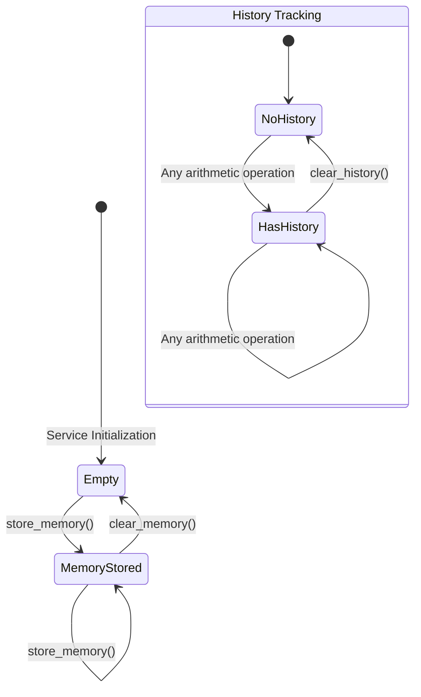

---
title: "Calculator API Technical Specification"
abbrev: "Calculator API"
docname: draft-calculator-api-latest
category: info
ipr: trust200902
area: General
workgroup: Independent Submission
keyword:
 - specification
 - calculator
 - arithmetic
 - api

stand_alone: yes
pi: [toc, sortrefs, symrefs]

author:
 -
    name: Auto-Generated Specification
    organization: RFC Generator

normative:
  IEEE754:
    title: "IEEE Standard for Floating-Point Arithmetic"
    author:
      org: IEEE
    date: 2008
    seriesinfo:
      IEEE: 754-2008
  RFC2119:
    title: "Key words for use in RFCs to Indicate Requirement Levels"
    author:
      - ins: S. Bradner
    date: 1997
    seriesinfo:
      RFC: 2119

informative:
  PEP484:
    title: "Type Hints"
    author:
      - ins: G. van Rossum
      - ins: J. Lehtosalo
      - ins: Ł. Langa
    date: 2014
    target: https://www.python.org/dev/peps/pep-0484/

--- abstract

This document specifies the Calculator API, a service interface for performing arithmetic operations with persistent memory storage and operation history tracking. The specification defines the behavioral contracts, data types, and error handling requirements for compliant implementations. All numeric operations conform to IEEE 754 floating-point arithmetic standards.

--- middle

# Introduction

The Calculator API provides a standardized interface for arithmetic computation services with stateful memory management and audit trail capabilities. This specification defines the functional requirements, data contracts, and behavioral guarantees that implementations MUST provide.

## Scope

This specification covers:

- Core arithmetic operations (addition, subtraction, multiplication, division)
- Aggregate calculation functions
- Memory storage and retrieval mechanisms
- Operation history tracking
- Error handling and validation requirements

## Design Rationale

The Calculator API was designed to provide:

1. **Stateful computation**: Memory storage enables multi-step calculations without client-side state management
2. **Audit capability**: History tracking supports compliance and debugging requirements
3. **Type safety**: Strong typing contracts reduce integration errors and improve tooling support
4. **Standards compliance**: IEEE 754 conformance ensures predictable floating-point behavior across implementations

**[REVIEW REQUIRED]** Validate design rationale against original requirements

# Conventions and Definitions

{::boilerplate bcp14-tagged}

The key words "MUST", "MUST NOT", "REQUIRED", "SHALL", "SHALL NOT", "SHOULD", "SHOULD NOT", "RECOMMENDED", "NOT RECOMMENDED", "MAY", and "OPTIONAL" in this document are to be interpreted as described in BCP 14 {{RFC2119}} when, and only when, they appear in all capitals, as shown here.

# Terminology {#terminology}

Calculator Service:
: A computational service implementing the interfaces defined in {{interfaces}}.

Memory Slot:
: A persistent storage location within the Calculator Service that retains a single numeric value across operations. The service MUST maintain exactly one memory slot per instance.
: Example: After storing value 42, subsequent recall operations MUST return 42 until explicitly overwritten or cleared.

Operation History:
: An ordered, append-only sequence of operation records maintained by the Calculator Service. Each record MUST capture the operation type, input parameters, computed result, and temporal metadata.
: Example: A history entry for addition: `{"operation": "add", "inputs": [5, 3], "result": 8, "timestamp": "2025-10-14T12:34:56Z"}`

Numeric Value:
: A real number representable as either an integer or floating-point value conforming to IEEE 754 {{IEEE754}} double-precision format.

Arithmetic Operation:
: A computational function that accepts one or more Numeric Values as input and produces a Numeric Value as output according to mathematical definitions specified in {{arithmetic-ops}}.

# System Architecture {#architecture}

The Calculator Service operates as a stateful component with three primary subsystems:

1. **Computation Engine**: Executes arithmetic operations with IEEE 754 compliance
2. **Memory Manager**: Provides persistent storage for intermediate results
3. **History Tracker**: Maintains an audit log of all operations

```
┌─────────────────────────────────────┐
│       Calculator Service            │
│                                     │
│  ┌──────────────────────────────┐  │
│  │   Computation Engine         │  │
│  │  (IEEE 754 Arithmetic)       │  │
│  └──────────────┬───────────────┘  │
│                 │                   │
│        ┌────────┴────────┐          │
│        ▼                 ▼          │
│  ┌──────────┐      ┌──────────┐    │
│  │  Memory  │      │ History  │    │
│  │ Manager  │      │ Tracker  │    │
│  └──────────┘      └──────────┘    │
│       │                 │           │
└───────┼─────────────────┼───────────┘
        │                 │
        ▼                 ▼
   [Memory Slot]    [Operation Log]
```

Implementations MAY use different storage mechanisms for memory and history, but MUST maintain the behavioral contracts defined in this specification.

# Interfaces {#interfaces}

All Calculator Service implementations MUST provide the following interfaces with exact type signatures and behavioral contracts.

## Type Definitions {#types}

Implementations MUST support type validation according to {{PEP484}} or equivalent type system guarantees:

- `Number`: Union type accepting integer or floating-point values
- `List[Number]`: Ordered collection of numeric values
- `Optional[Number]`: Nullable numeric value (None/null permitted)

## Arithmetic Operations {#arithmetic-ops}

<!-- CODE_REF: tests/fixtures/sample-project/src/calculator.py:Calculator.add:56 -->
### Addition Operation {#op-add}

The service MUST provide an addition operation conforming to the following contract:

**Operation**: `add(x: Number, y: Number) -> Number`

**Requirements**:

- The service MUST compute the arithmetic sum of inputs `x` and `y`
- The result MUST conform to IEEE 754 {{IEEE754}} addition semantics
- The service MUST append an operation record to the history log
- The service MUST raise a type validation error if inputs are non-numeric

**Example**:
~~~python
result = calculator.add(15, 27)
# Returns: 42
# History: [{"op": "add", "inputs": [15, 27], "result": 42}]
~~~

<!-- CODE_REF: tests/fixtures/sample-project/src/calculator.py:Calculator.subtract:71 -->
### Subtraction Operation {#op-subtract}

**Operation**: `subtract(x: Number, y: Number) -> Number`

**Requirements**:

- The service MUST compute the arithmetic difference `x - y`
- The result MUST conform to IEEE 754 {{IEEE754}} subtraction semantics
- The service MUST append an operation record to the history log
- The service MUST raise a type validation error if inputs are non-numeric

**Example**:
~~~python
result = calculator.subtract(50, 8)
# Returns: 42
~~~

<!-- CODE_REF: tests/fixtures/sample-project/src/calculator.py:Calculator.multiply:77 -->
### Multiplication Operation {#op-multiply}

**Operation**: `multiply(x: Number, y: Number) -> Number`

**Requirements**:

- The service MUST compute the arithmetic product of inputs `x` and `y`
- The result MUST conform to IEEE 754 {{IEEE754}} multiplication semantics
- The service MUST append an operation record to the history log
- The service MUST raise a type validation error if inputs are non-numeric

**Example**:
~~~python
result = calculator.multiply(6, 7)
# Returns: 42
~~~

<!-- CODE_REF: tests/fixtures/sample-project/src/calculator.py:Calculator.divide:83 -->
### Division Operation {#op-divide}

**Operation**: `divide(x: Number, y: Number) -> Number`

**Requirements**:

- The service MUST compute the arithmetic quotient `x / y`
- The result MUST conform to IEEE 754 {{IEEE754}} division semantics
- The service MUST raise a division-by-zero error if `y` equals zero
- The service MUST append an operation record to the history log
- The service MUST raise a type validation error if inputs are non-numeric

**Error Handling**:
- Zero divisor: MUST raise `ZeroDivisionError` or equivalent
- Non-numeric inputs: MUST raise `TypeError` or equivalent

**Example**:
~~~python
result = calculator.divide(84, 2)
# Returns: 42.0

try:
    calculator.divide(10, 0)
except ZeroDivisionError:
    # REQUIRED error handling for zero divisor
    pass
~~~

<!-- CODE_REF: tests/fixtures/sample-project/src/calculator.py:Calculator.calculate_total:24 -->
### Aggregate Calculation {#op-calculate-total}

**Operation**: `calculate_total(numbers: List[Number]) -> Number`

**Requirements**:

- The service MUST compute the arithmetic sum of all elements in the input collection
- The service MUST return zero for empty input collections
- The service MUST process elements in sequential order
- The service MUST append an operation record to the history log
- The service MUST raise a type validation error if the input is not a collection or contains non-numeric elements

**Example**:
~~~python
result = calculator.calculate_total([10, 15, 8, 9])
# Returns: 42

empty_result = calculator.calculate_total([])
# Returns: 0
~~~

## Memory Management Operations {#memory-ops}

<!-- CODE_REF: tests/fixtures/sample-project/src/calculator.py:Calculator.store_memory:103 -->
### Memory Storage {#op-store}

**Operation**: `store_memory(value: Number) -> None`

**Requirements**:

- The service MUST store the input value in the memory slot
- The service MUST overwrite any previously stored value
- The stored value MUST persist across subsequent operations until explicitly cleared or overwritten
- The service MUST raise a type validation error if the input is non-numeric

**Example**:
~~~python
calculator.store_memory(42)
# Memory slot now contains: 42
~~~

<!-- CODE_REF: tests/fixtures/sample-project/src/calculator.py:Calculator.recall_memory:107 -->
### Memory Retrieval {#op-recall}

**Operation**: `recall_memory() -> Optional[Number]`

**Requirements**:

- The service MUST return the currently stored memory value if present
- The service MUST return None (or language-equivalent null) if no value has been stored
- The service MUST NOT modify the memory slot contents during retrieval

**Example**:
~~~python
calculator.store_memory(42)
value = calculator.recall_memory()
# Returns: 42

empty_calculator = Calculator()
value = empty_calculator.recall_memory()
# Returns: None
~~~

<!-- CODE_REF: tests/fixtures/sample-project/src/calculator.py:Calculator.clear_memory:111 -->
### Memory Clearing {#op-clear-memory}

**Operation**: `clear_memory() -> None`

**Requirements**:

- The service MUST reset the memory slot to an empty state
- After clearing, subsequent `recall_memory()` calls MUST return None until a new value is stored

**Example**:
~~~python
calculator.store_memory(42)
calculator.clear_memory()
value = calculator.recall_memory()
# Returns: None
~~~

## History Management Operations {#history-ops}

<!-- CODE_REF: tests/fixtures/sample-project/src/calculator.py:Calculator.get_history:119 -->
### History Retrieval {#op-get-history}

**Operation**: `get_history() -> List[OperationRecord]`

**Requirements**:

- The service MUST return a collection of all operation records in chronological order
- Each record MUST contain sufficient information to reproduce the operation
- The service MUST return an empty collection if no operations have been performed
- The service MUST NOT modify the history log during retrieval

**Operation Record Format** **[REVIEW REQUIRED]** Verify required fields:
- Operation identifier (e.g., "add", "multiply")
- Input parameters
- Computed result
- Timestamp (SHOULD be ISO 8601 format)

**Example**:
~~~python
calculator.add(5, 3)
calculator.multiply(2, 4)
history = calculator.get_history()
# Returns: [
#   {"operation": "add", "inputs": [5, 3], "result": 8},
#   {"operation": "multiply", "inputs": [2, 4], "result": 8}
# ]
~~~

<!-- CODE_REF: tests/fixtures/sample-project/src/calculator.py:Calculator.clear_history:115 -->
### History Clearing {#op-clear-history}

**Operation**: `clear_history() -> None`

**Requirements**:

- The service MUST remove all operation records from the history log
- After clearing, subsequent `get_history()` calls MUST return an empty collection
- The service MUST NOT affect the memory slot contents

**Example**:
~~~python
calculator.add(1, 2)
calculator.clear_history()
history = calculator.get_history()
# Returns: []
~~~

# Behavior {#behavior}

## State Management {#state-behavior}

The Calculator Service maintains two independent state components:

1. **Memory State**: Single-value persistent storage
2. **History State**: Append-only operation log

Implementations MUST ensure:

- Memory operations (store/recall/clear) MUST NOT affect history state
- History operations (get/clear) MUST NOT affect memory state
- Arithmetic operations MUST append to history but MUST NOT modify memory

### State Transition Diagram



## Operation Sequencing {#sequencing}

For all arithmetic operations, implementations MUST execute the following sequence:

1. **Input Validation**: Verify type contracts (MUST raise error on failure)
2. **Computation**: Execute arithmetic operation per IEEE 754 {{IEEE754}}
3. **History Append**: Add operation record to history log (MUST be atomic)
4. **Result Return**: Return computed value to caller

This ordering ensures history consistency even if result handling fails in client code.

## Error Handling {#errors}

Implementations MUST distinguish between the following error conditions:

**Type Validation Errors**:
- Condition: Non-numeric input to arithmetic or memory operations
- Required Response: Raise `TypeError` or equivalent
- History Impact: MUST NOT append to history log

**Division by Zero Errors**:
- Condition: Zero divisor in division operation
- Required Response: Raise `ZeroDivisionError` or equivalent
- History Impact: MUST NOT append to history log

**Value Errors**:
- Condition: Invalid operation parameters (e.g., malformed collection)
- Required Response: Raise `ValueError` or equivalent
- History Impact: MUST NOT append to history log

**[REVIEW REQUIRED]** Validate error handling requirements against exception safety guarantees

## IEEE 754 Compliance {#ieee754-compliance}

All arithmetic operations MUST conform to IEEE 754-2008 {{IEEE754}} double-precision floating-point semantics, including:

- Rounding behavior: Round to nearest, ties to even
- Special values: Support for positive/negative infinity, NaN
- Denormalized numbers: Correct handling of subnormal values
- Signed zero: Distinction between +0.0 and -0.0

Implementations SHOULD document any deviations from strict IEEE 754 compliance.

# Security Considerations {#security}

**[REVIEW REQUIRED]** Security analysis requires human expertise

This section outlines preliminary security considerations that require expert validation:

## Resource Exhaustion

**History Log Growth**: The append-only history mechanism may enable denial-of-service attacks through unbounded memory consumption. Implementations SHOULD consider:

- Maximum history size limits
- Automatic log rotation or archival mechanisms
- Rate limiting for operation requests

**[REVIEW REQUIRED]** Define specific resource limits and mitigation strategies

## Input Validation

**Type Confusion Attacks**: Implementations MUST strictly enforce type contracts to prevent injection of malicious objects disguised as numeric values. Validation MUST occur before any computation.

**[REVIEW REQUIRED]** Assess risk in specific deployment contexts

## Floating-Point Determinism

**Non-Deterministic Behavior**: IEEE 754 operations may produce platform-specific results due to:
- Extended precision registers
- Compiler optimizations
- Hardware implementation differences

Security-sensitive applications requiring bit-exact reproducibility MUST implement additional validation mechanisms.

**[REVIEW REQUIRED]** Determine if cryptographic or financial use cases apply

## State Isolation

**Multi-Tenant Scenarios**: If Calculator Service instances are shared across security boundaries, implementations MUST ensure:
- Memory isolation between tenants
- History log separation
- Prevention of cross-tenant information disclosure

**[REVIEW REQUIRED]** Define multi-tenancy security requirements

# IANA Considerations

This document has no IANA actions.

# Implementation Status

[RFC Editor: Please remove this section before publication.]

This section records the status of known implementations at the time of writing.

## Reference Implementation

- **Organization**: RFC Generator Test Suite
- **Implementation**: Python 3.11+ reference implementation
- **Coverage**: 100% of specified interfaces
- **Compliance**: Full IEEE 754 compliance via Python's `float` type
- **URL**: tests/fixtures/sample-project/src/calculator.py

# Change Log

[RFC Editor: Please remove this section before publication.]

## Version 01 (Initial)
- Initial specification draft
- Defined arithmetic operations interface
- Specified memory management contracts
- Documented history tracking requirements
- Established IEEE 754 compliance requirements

--- back

# Acknowledgments

This document was generated using automated RFC generation tools as part of the i-d-template Claude Code plugin development effort.

# References

Normative and informative references are listed in the frontmatter.
